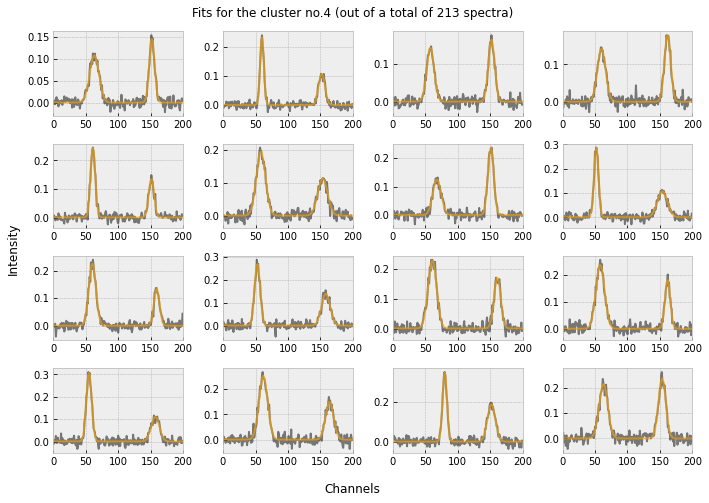

<div id="top"></div>
<!-- PROJECT SHIELDS -->
<!--
*** I'm using markdown "reference style" links for readability.
*** Reference links are enclosed in brackets [ ] instead of parentheses ( ).
*** See the bottom of this document for the declaration of the reference variables
*** for contributors-url, forks-url, etc. This is an optional, concise syntax you may use.
*** https://www.markdownguide.org/basic-syntax/#reference-style-links
-->

[![Issues][issues-shield]][issues-url]
[![Forks][forks-shield]][forks-url]
[![Stars][stars-shield]][stars-url]
[![MIT License][license-shield]][license-url]

<div align="center">

<h3 align="center">Spectral SOM</h3>

  <p align="center">
    Application of a Self-Organizing Map to the context of spectral analysis
    <br />
    <a href="https://github.com/github_username/repo_name"><strong>Explore the docs (Coming Soon) »</strong></a>
    <br />
    <br />
    <a href="#usage">Example</a>
    ·
    <a href="https://github.com/SimoneSped/SOM/issues">Report Bug</a>
    ·
    <a href="https://github.com/SimoneSped/SOM/issues">Request Feature</a>
  </p>
</div>
<!-- TABLE OF CONTENTS -->
<details>
  <summary>Table of Contents</summary>
  <ol>
    <li>
      <a href="#about-the-project">About The Project</a>
      <ul>
        <li><a href="#built-with">Built With</a></li>
      </ul>
    </li>
    <!--<li>
      <a href="#getting-started">Getting Started</a>
      <ul>
        <li><a href="#prerequisites">Prerequisites</a></li>
        <li><a href="#installation">Installation</a></li>
      </ul>
    </li>-->
    <li><a href="#usage">Example</a></li>
    <li><a href="#roadmap">Roadmap</a></li>
    <!--<li><a href="#contributing">Contributing</a></li>-->
    <li><a href="#license">License</a></li>
    <li><a href="#contact">Contact</a></li>
    <li><a href="#acknowledgments">Acknowledgments</a></li>
  </ol>
</details>

<!-- ABOUT THE PROJECT -->

## About The Project

<div align="center">
  <a href="https://github.com/SimoneSped/SOM/">
    
  </a>
</div>

Python tool for the application of a machine learning technique, the so-called Self-Organinzing Maps of Features, to the world of spectral analysis. This aims at speeding up the process of categorization and Gaussian decomposition through the means of pattern e.g. similarities recognition in the implemented neuron network. This idea was first introduced in a <a href=https://ieeexplore.ieee.org/abstract/document/58325> 1990 paper from T. Kohonen</a>, pointing out at the astonishing ways the neurons in the human brain orgnize themselves when reacting to sensorial input. This work is implemented in the context of the Bachelor Thesis in Astronomy and Astrophysics by Simone Spedicato.


### Built With

* [Python](https://www.python.org/)


<!--## Getting Started

This is an example of how you may give instructions on setting up your project locally.
To get a local copy up and running follow these simple example steps.

### Prerequisites

This is an example of how to list things you need to use the software and how to install them.
* npm
  ```sh
  npm install npm@latest -g
  
  ### Installation

1. Get a free API Key at [https://example.com](https://example.com)
2. Clone the repo
   ```sh
   git clone https://github.com/github_username/repo_name.git
   ```
3. Install NPM packages
   ```sh
   npm install
   ```
4. Enter your API in `config.js`
   ```js
   const API_KEY = 'ENTER YOUR API';
   ```

<p align="right">(<a href="#top">back to top</a>)</p>-->

<!-- USAGE EXAMPLES -->

## Usage

Coming Soon...

_For more examples, please refer to the [Documentation](https://example.com)_(Coming Soon)


<!-- ROADMAP -->

## Roadmap

- [ ] General improvements  
    - [ ] Faster execution
    - [ ] Better interface with the user
    - [ ] Better input handling
    - [ ] Further hanling of worse fits
- [ ] Study of absorption line profiles

See the [open issues](https://github.com/SimoneSped/SOM/issues) for a full list of proposed features (and known issues).


<!-- CONTRIBUTING 

## Contributing

Contributions are what make the open source community such an amazing place to learn, inspire, and create. Any contributions you make are **greatly appreciated**.

If you have a suggestion that would make this better, please fork the repo and create a pull request. You can also simply open an issue with the tag "enhancement".
Don't forget to give the project a star! Thanks again!

1. Fork the Project
2. Create your Feature Branch (`git checkout -b feature/AmazingFeature`)
3. Commit your Changes (`git commit -m 'Add some AmazingFeature'`)
4. Push to the Branch (`git push origin feature/AmazingFeature`)
5. Open a Pull Request

<p align="right">(<a href="#top">back to top</a>)</p>-->


<!-- LICENSE -->

## License

Distributed under the MIT License. See `LICENSE.txt` for more information.


<!-- CONTACT -->

## Contact

Simone Spedicato - simonespedicatospf@gmail.com

Project Link: [https://github.com/SimoneSped/SOM](https://github.com/SimoneSped/SOM)


<!-- ACKNOWLEDGMENTS -->

## Acknowledgments

* [EMERGE Group @ Astronomy Institute of the University of Vienna](https://emerge.univie.ac.at/)

<p align="right">(<a href="#top">back to top</a>)</p>

[forks-shield]: https://img.shields.io/github/forks/SimoneSped/SOM
[forks-url]: https://github.com/github_username/repo_name/network/members
[issues-shield]: https://img.shields.io/github/issues/SimoneSped/SOM
[issues-url]: https://github.com/SimoneSped/SOM/issues
[stars-shield]: https://img.shields.io/github/stars/SimoneSped/SOM
[stars-url]: https://github.com/github_username/repo_name/stargazers
[license-shield]: https://img.shields.io/github/license/SimoneSped/SOM
[license-url]: https://github.com/github_username/repo_name/blob/master/LICENSE.txt
[fits-screenshot]: figures/fits.png
